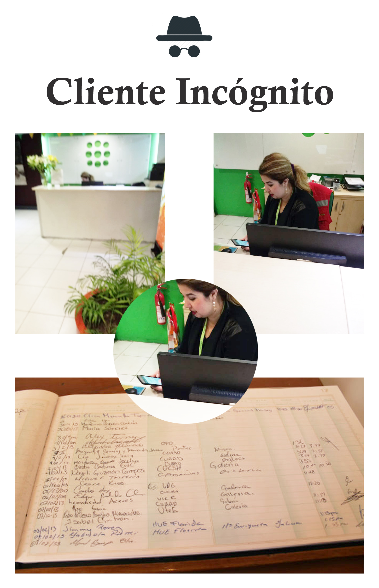
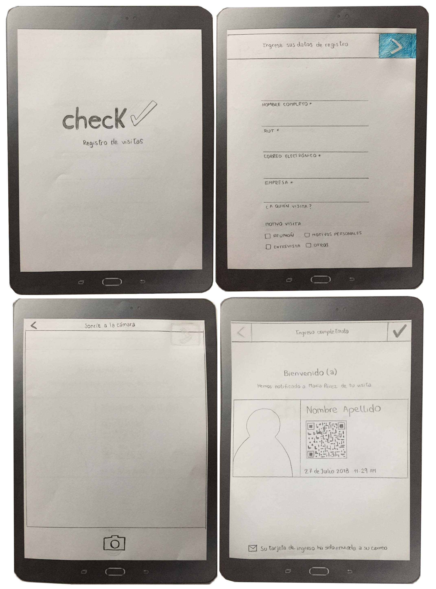

# Check, registro de visitantes

## C H E C K

El registro de visitantes en las empresas Latinoamericanas es un proceso en general tedioso y manual. Lo común es que una persona esté en la recepción tomando nota - a veces con papel y lápiz - de cada visitante. Por razones de seguridad, usualmente piden a cada visitante dejar una identificación. Como vivimos en la era digital planteamos nuestra solución creando una interfaz que permite al visitante realizar su ingreso en recepción por medio de una tablet, donde se solicitaran datos básicos de identificación y una fotografía.

Puedes acceder al Proyecto desde el siguiente link [Check](https://noeliasabando.github.io/Check/)

## Introducción

Los integrantes del Equipo son:
   * Diseñadora UX
      VALERIA DROGUETT
      Diseñar la experiencia de la aplicación (flujo, interacción, etc.).
      Identificar, documentar y priorizar las historias de usuario.
      Crear el diseño visual de la interfaz.
   * Desarrolladoras Front-end
      NOELIA SABANDO
      MARÍA LORETO HENRÍQUEZ
      Implementar la interfaz de usuario diseñada (HTML/CSS/JS).

## Entrevistas

[Accede a entrevistas](https://docs.google.com/document/d/18EkdIh1XidEnjCW9tUCOa52JRaREPmKkTVtT-1K4O_w/edit?usp=sharing)

## Testing de prototipo con usuarios
[Video 1](https://trello-attachments.s3.amazonaws.com/5b5b1d5e0a881f95c38d06dc/5b5b1eb17598aa7a172bcf04/728427a159441d002d6edf3003636aee/3D69DFFF-10F9-4752-9924-899B280859B3.mp4)

[Video 2](https://trello-attachments.s3.amazonaws.com/5b5b1d5e0a881f95c38d06dc/5b5b1eb17598aa7a172bcf04/315929b99daf1149924366980ea84c36/53E94600-4E68-4BE2-AE97-E4E75A90598D.mp4)

[Video 3](https://trello-attachments.s3.amazonaws.com/5b5b1d5e0a881f95c38d06dc/5b5b1eb17598aa7a172bcf04/a42fe3e8230a1dc18c0d7b53f1e05895/8D88FD84-2021-40C6-9A25-901185B41E87.mp4)

## Cliente Incógnito

Investigación Cliente incógnito
Flujo
  * Al acceder a al edificio me dirijo al módulo de Recepción
  * Luego de saludar, la recepcionista me pregunta a quien busco
  * Le indico el nombre y me pide los siguientes datos mientras registra fecha y hora de visita
    * Nombre Completo
    * Empresa a la cuál pertenezco
    * Nombre de la persona a quien visito
    * Motivo
  * Luego mi firma al final de la línea de registro
  * Posterior a esto, toma su teléfono y vía What´s APP contacta a la persona para avisar mi llegada, quien le confirma en unos minutos y me pide que tome asiento mientras espero.

El tiempo desde que la recepcionista me atiende, toma mis datos, contacta y confirma con la persona solicitada 5 minutos.

## Análisis

[Benchmark](https://docs.google.com/document/d/1VkenvA0UXuliywDzOqdJMzYcM-nd645OJOhE7Tdrgr8/edit?usp=sharing)

## Prototipo de Baja Fidelidad

## Prototipo de Alta Fidelidad
El prototipo de Alta Fidelidad fue realizado en Figma, puedes acceder ingresando al siguiente link.
[Prototipo Alta Fidelidad](https://www.figma.com/file/NpJHXb1JJ0is6XHz6vTERYij/Check-Registro-de-visitas?node-id=0%3A1)

## Organización

La Organización del Equipo puedes revisarla en este link.
[Trello](https://trello.com/b/GefglG1c/registro-usuario)

## Proyecto desarrollado para
[Laboratoria](http://www.laboratoria.la/)

